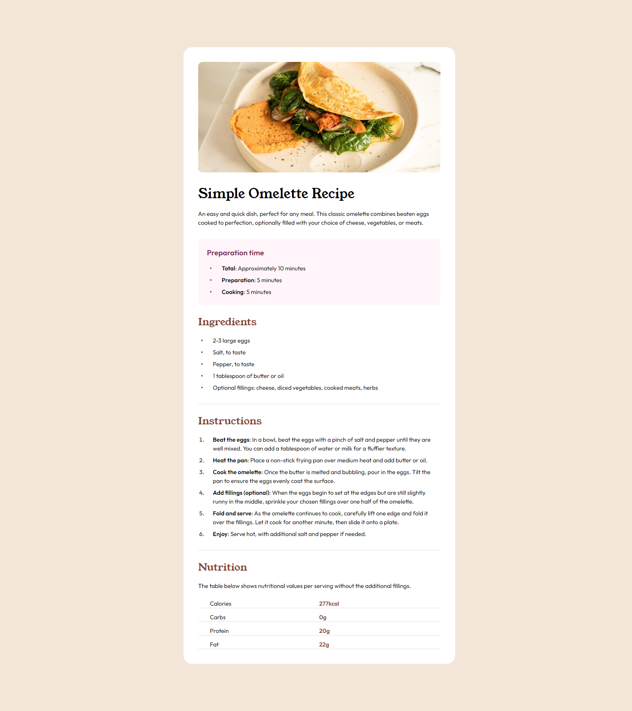

# Frontend Mentor - Recipe page challenge

This is a solution to the [Recipe page challenge](https://www.frontendmentor.io/challenges/recipe-page-KiTsR8QQKm).

## Table of contents

- [Overview](#overview)
  - [The challenge](#the-challenge)
  - [Screenshot](#screenshot)
  - [Links](#links)
- [My process](#my-process)
  - [Built with](#built-with)
  - [What I learned](#what-i-learned)
  - [Continued development](#continued-development)
- [Author](#author)

## Overview

### The challenge

build out this recipe page and get it looking as close to the design as possible.

### Screenshot



### Links

- Live Site URL: [on netlify](https://sunny-moonbeam-286882.netlify.app/)

## My process

I was working on making structure of my code little better than previously. First I created some sort of generic Card looking component. It didn't feel right and in the end I changed it to more content aware Recipe. It helps, when I pick a some context for the components I'm building. This time I decided to crete a reusable Recipe, which could be used on some sort of of recipe website.

### Built with

- Mobile-first workflow
- [TS](https://www.typescriptlang.org/) - Typescript
- [React](https://reactjs.org/) - JS library
- [Tailwindcss](https://tailwindcss.com/) - For styles

### What I learned

I learned how to use typeof operator in TS. It came very handy when I needed type for my structured data. Instead of defining it by hand as usually, I simply inferred type like this

```ts
export type RecipeData = typeof recipe;
```

Also learned the hard way, that in vite, absolute urls in image source are resolved with origin starting in /public not root of my project as I thought previously.

### Continued development

Will continue experimenting with structure of components and try to use typeof in more places.

## Author

- Frontend Mentor - [@raswonders](https://www.frontendmentor.io/profile/raswonders)
- Twitter - [@raswonders](https://www.twitter.com/raswonders)
- LinkedIn - [Rastislav Hepner](https://www.linkedin.com/in/rastislavhepner/)
